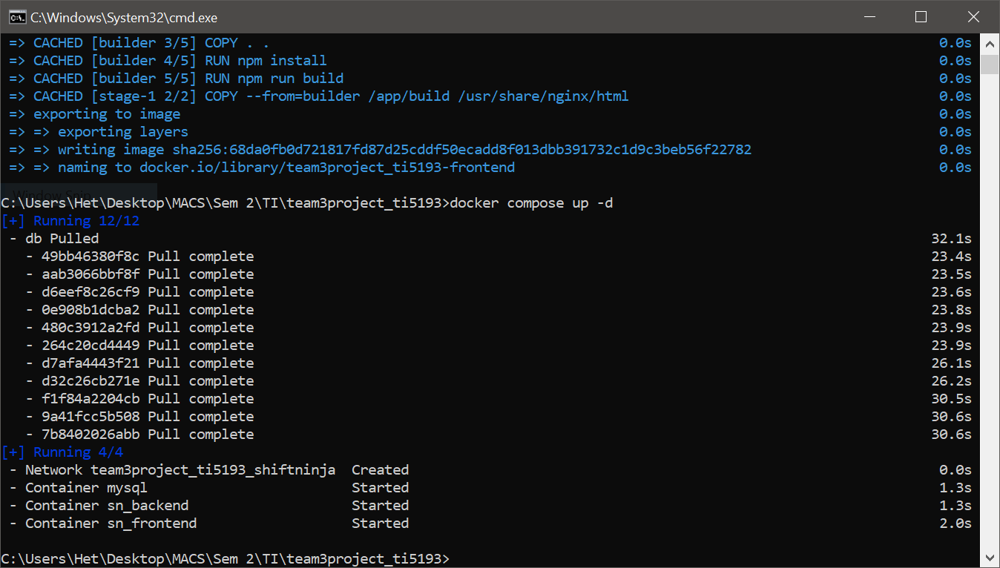
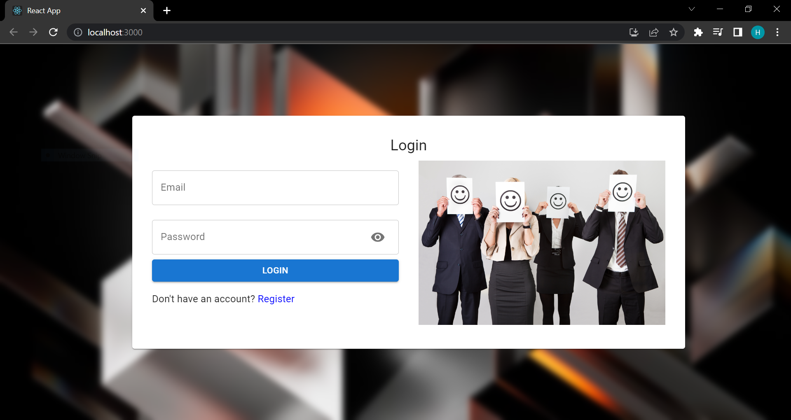
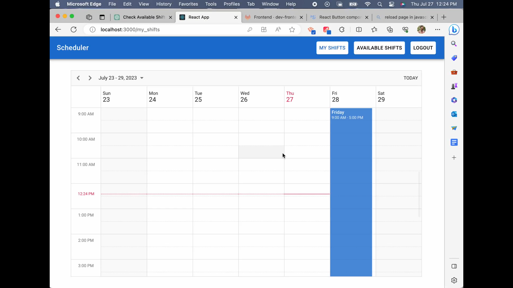
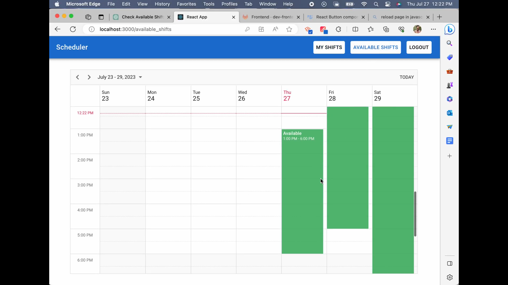
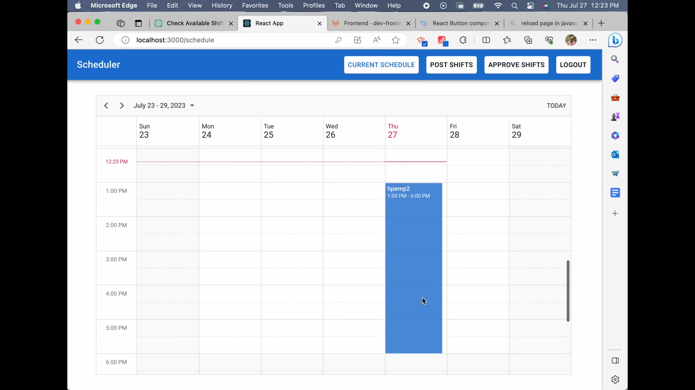
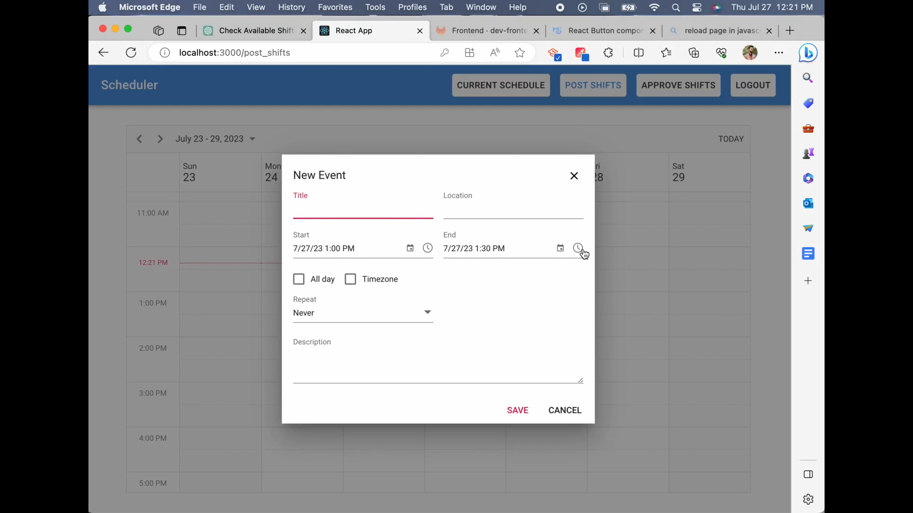
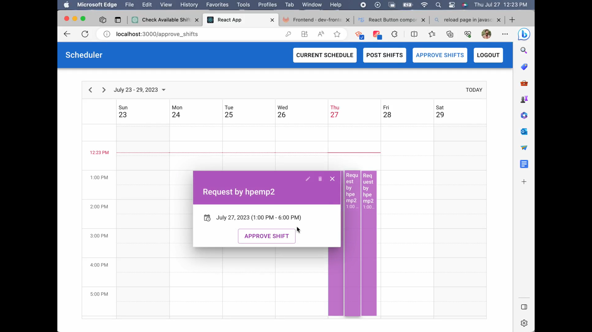

<h1 style ="font-family: Arial" align="center"><b>ShiftNinja</b></h1>

ShiftNinja is an application that aims to make the scheduling process simple and efficient for employees and managers alike.

<h2 style ="font-family: Arial">Developed by</h2> 

<table style="border-collapse: collapse;">
    <tr style="border: none;">
      <th style="border: none;">Member</th>
      <th style="border: none;">Banner ID</th>
      <th style="border: none;">Role</th>
    </tr>
    <tr style="border: none;">
      <td style="border: none;">Brahmdeep Aneja</td>
      <td style="border: none;">B00922690</td>
      <td style="border: none;">Backend Developer</td>
    </tr>
    <tr style="border: none;">
      <td style="border: none;">Harmit Narula</td>
      <td style="border: none;">B00921449</td>
      <td style="border: none;">Developer and cloud specialist</td>
    </tr>
    <tr style="border: none;">
      <td style="border: none;">Amandeep Singh</td>
      <td style="border: none;">B00925864</td>
      <td style="border: none;">Backend Developer</td>
    </tr>
    <tr style="border: none;">
      <td style="border: none;">Het Mehta</td>
      <td style="border: none;">B00916261</td>
      <td style="border: none;">Frontend Developer</td>
    </tr>
    <tr style="border: none;">
      <td style="border: none;">Shahraj Singh</td>
      <td style="border: none;">B00943028</td>
      <td style="border: none;">Backend and Frontend Developer</td>
    </tr>
    <tr style="border: none;">
      <td style="border: none;">Tanisha</td>
      <td style="border: none;">B00946400</td>
      <td style="border: none;">Backend Developer and Scrum master</td>
    </tr>
  </table>

<h2 style ="font-family: Arial">Important links</h2>
Deployment link: <a href="http://shiftninja.canadacentral.cloudapp.azure.com:5000">http://shiftninja.canadacentral.cloudapp.azure.com:5000</a>  
Gitlab link: <a href = "https://git.cs.dal.ca/tanisha/team3project_ti5193.git">https://git.cs.dal.ca/tanisha/team3project_ti5193.git</a>  
<h2 style ="font-family: Arial">Build instructions</h2>

The application is divided into frontend and backend, the instruction below covers how to build both components and run them

<b>Backend</b> 

Backend for this application has been written using Spring Boot that has been dockerized. To build the backend -

1. Navigate to the root folder using command (For instance)- *cd team3project_ti5193*
2. Start your docker desktop application on your system 
3. Run the command *docker compose build* to build the docker image and *docker compose up -d* to create containers and run the APIs on port 8080 

<figure align="center">
  
  <figcaption>Backend build and run.</figcaption>
</figure>

<b>Frontend</b> 

Frontend for this application has been written using React. To build the frontend -

1. Navigate to the frontend folder using command (For instance) - *cd team3project_ti5193/Frontend*
2. Run the command *npm i* to install all dependencies
3. Run the command *npm start* to start the application at port 

<figure align="center">
  
  <figcaption>Frontend application.</figcaption>
</figure>

<h2 style ="font-family: Arial">Use Cases</h2> 

<b>Employee</b> 

1. After logging in employee can see their schedule week's schedule 
<figure align="center">
  
  <figcaption>Employee Current Shift Schedule.</figcaption>
</figure>
2. Employee can also go to Available Shifts page and see all the available shifts and request for any shifts they want to work for.

<figure align="center">
  
  <figcaption>Employee Available Shifts Schedule.</figcaption>
</figure>

<b>Manager</b> 

1. After logging in Managers can see the upcoming weeks' schedule and see specifics of a shift including time and employee details.

<figure align="center">
  
  <figcaption>Manager Current Shift Schedule.</figcaption>
</figure>
2. Manager can also go to Post Shifts page and post a new shift availability which would be visible to employees and they can request for approval.
<figure align="center">
  
  <figcaption>Manager Post Shifts.</figcaption>
</figure>

3. After Employees have requested for approval for any shift, manager can check the requests in the Approve Shifts page and select the requests they want to approve, which will then be reflected in Employee's current schedule.
<figure align="center">
  
  <figcaption>Manager Post Shifts.</figcaption>
</figure>

<h2 style ="font-family: Arial">Code References</h2>

<ul style="list-style: none;">
    [1] Arias, Dan. “The Complete Guide to React User Authentication with Auth0.” Auth0 - Blog, 18 Nov. 2022, auth0.com/blog/complete-guide-to-react-user-authentication. Accessed 27 July 2023.  
    [2] “Modern React Event Calendar | Mobiscroll.” Demo.mobiscroll.com, 10 June 2023, demo.mobiscroll.com/react/eventcalendar. Accessed 27 July 2023.  
    [3]Slamic, Tadej. “Spring Boot Authorization Tutorial: Secure an API (Java).” Auth0 - Blog, 7 Oct. 2021, auth0.com/blog/spring-boot-authorization-tutorial-secure-an-api-java/. Accessed 27 July 2023.  
    [4]“Event Handling in Spring.” Www.tutorialspoint.com, www.tutorialspoint.com/spring/event_handling_in_spring.htm. Accessed 27 July 2023.  
    [5]Romero, Erick. “How to Dockerize a Spring Boot Application.” EPAM Anywhere, 7 July 2023, anywhere.epam.com/en/blog/how-to-dockerize-spring-boot-application. Accessed 27 July 2023.
</ul>